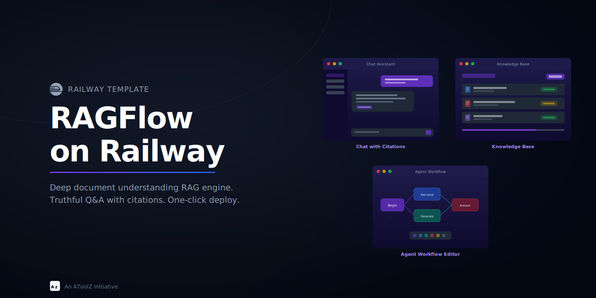

<p align="center">
  
</p>

<p align="center">
  <strong>Deep document understanding RAG engine with Elasticsearch, MySQL, MinIO, and Redis. One-click deploy to Railway.</strong>
</p>

<p align="center">
  <a href="https://railway.com/deploy/ragflow">
    
  </a>
</p>

<p align="center">
  <a href="https://github.com/atoolz/railway-ragflow/blob/main/LICENSE">
    
  </a>
  
  
  
  
</p>

<br>

## Deploy and Host RAGFlow on Railway

RAGFlow is an open-source RAG (Retrieval-Augmented Generation) engine built on deep document understanding. It extracts knowledge from PDFs, Word docs, Excel, PPTs, images, and more using layout-aware parsing that preserves document structure. Every answer comes with traceable citations to source documents. Connect any LLM provider, build complex retrieval workflows with the visual agent editor, and deploy the full stack in one click.

### About Hosting RAGFlow

The template deploys five services on Railway's private network. RAGFlow runs as a Docker container (~5GB image) with nginx serving the React frontend and proxying API requests to the Python backend on port 9380. Elasticsearch handles vector search and document indexing. MySQL stores metadata, user data, and configuration. MinIO provides S3-compatible object storage for uploaded documents. Redis manages caching, sessions, and task queues. All services communicate over Railway's internal network using private domains. The RAGFlow container uses a custom start script that configures nginx at runtime and delegates to the original entrypoint for database initialization and worker processes.

### Common Use Cases

- Building internal knowledge bases from company documents (contracts, manuals, policies) with citation-backed Q&A accessible to the entire team
- Deploying a self-hosted alternative to ChatGPT with your own data, keeping sensitive documents on infrastructure you control
- Creating customer support assistants that answer questions from product documentation, FAQs, and support tickets with source references

### Dependencies for Hosting

- A Railway account with sufficient resources (~8GB RAM total across services, ~83GB storage)
- An LLM API key (OpenAI, Anthropic, DeepSeek, or any OpenAI-compatible endpoint) configured after first login

#### Deployment Dependencies

- [RAGFlow documentation](https://ragflow.io/docs/)
- [Elasticsearch reference](https://www.elastic.co/guide/en/elasticsearch/reference/8.11/index.html)
- [MinIO documentation](https://min.io/docs/minio/container/index.html)

### Why Deploy on Railway?

Railway is a singular platform to deploy your infrastructure stack. Railway will host your infrastructure so you don't have to deal with configuration, while allowing you to vertically and horizontally scale it.

By deploying RAGFlow on Railway, you are one step closer to supporting a complete AI-powered knowledge base with minimal burden. Host your servers, databases, AI agents, and more on Railway.

<br>

## What's Inside

A production-ready deployment of [RAGFlow](https://github.com/infiniflow/ragflow) with all required infrastructure services configured and connected.

| Service | Technology | Role |
|---------|-----------|------|
| **RAGFlow** | infiniflow/ragflow v0.24.0 | RAG engine with web UI, REST API, and document processing |
| **Elasticsearch** | Elasticsearch 8.11.3 | Vector search, document indexing, and full-text retrieval |
| **MySQL** | MySQL 8.0 (Railway native) | Metadata, user data, and configuration storage |
| **MinIO** | MinIO (S3-compatible) | Object storage for uploaded documents and files |
| **Redis** | Valkey 8 (Railway native) | Caching, session management, and task queues |

<br>

## Why RAGFlow

**Deep Document Understanding** goes beyond naive chunking. RAGFlow uses layout-aware parsing to extract knowledge from PDFs, Word, Excel, PPTs, and images while preserving document structure and context.

**Citation-backed Answers** means every response includes traceable references to source documents. No hallucinated answers, no guessing. Users can verify exactly where each piece of information came from.

**Multi-model Flexibility** lets you connect any LLM provider: OpenAI, Anthropic, DeepSeek, local models via Ollama, or any OpenAI-compatible API. Switch models without changing your knowledge base.

**Agentic RAG** provides a visual workflow editor for building complex retrieval pipelines. Combine multiple knowledge bases, add reasoning steps, and create sophisticated Q&A workflows without code.

<br>

## Architecture

```
                    ┌─────────────────┐
                    │   User Browser  │
                    └────────┬────────┘
                             │ :80
                    ┌────────▼────────┐
                    │    RAGFlow      │
                    │  (Web UI + API) │
                    └──┬──┬──┬──┬────┘
           ┌───────────┘  │  │  └───────────┐
           │              │  │              │
    ┌──────▼──────┐ ┌─────▼──▼─────┐ ┌─────▼─────┐
    │ Elasticsearch│ │    MySQL     │ │   MinIO   │
    │   :9200     │ │    :3306     │ │   :9000   │
    │  (vectors)  │ │  (metadata)  │ │  (files)  │
    └─────────────┘ └──────────────┘ └───────────┘
                           │
                    ┌──────▼──────┐
                    │    Redis    │
                    │    :6379    │
                    │   (cache)   │
                    └─────────────┘
```

<br>

## Key Features

- **Template-based Chunking** preserves document structure during parsing
- **Multi-format Support** handles PDF, Word, Excel, PPT, images, markdown, and more
- **Visual Agent Editor** for building complex RAG workflows without code
- **MCP Server** built-in for Model Context Protocol tool integration
- **REST API** for programmatic access to all RAGFlow capabilities
- **Multi-tenant** with user registration and role-based access

<br>

## Deploy to Railway

Click the button above or:

1. Fork this repo
2. Create a new project on [Railway](https://railway.com)
3. Add a **MySQL** database (Railway native)
4. Add a **Redis** database (Railway native)
5. Add three services from your forked repo, each pointing to a subdirectory:

| Service | Root Directory | Port |
|---------|---------------|------|
| RAGFlow | `ragflow/` | 80 |
| Elasticsearch | `elasticsearch/` | 9200 |
| MinIO | `minio/` | 9000 |

6. Set environment variables on RAGFlow (see below) referencing the other services
7. Generate a domain for the RAGFlow service
8. Deploy

<br>

## After Deployment

1. Access the RAGFlow web UI through the public URL Railway assigns
2. Create an admin account on first visit
3. Go to **Model Providers** and configure at least one LLM (OpenAI, Anthropic, Ollama, etc.)
4. Create a **Knowledge Base** and upload your documents
5. Create an **Assistant** linked to your knowledge base
6. Start asking questions with citation-backed answers

<br>

## Environment Variables

### RAGFlow

| Variable | Required | Default | Description |
|----------|----------|---------|-------------|
| `MYSQL_HOST` | Yes | - | `${{MySQL.RAILWAY_PRIVATE_DOMAIN}}` |
| `MYSQL_PORT` | No | `3306` | MySQL port |
| `MYSQL_PASSWORD` | Yes | - | `${{MySQL.MYSQL_ROOT_PASSWORD}}` |
| `MYSQL_DBNAME` | No | `rag_flow` | Database name |
| `MYSQL_USER` | No | `root` | Database user |
| `ES_HOST` | Yes | - | `${{Elasticsearch.RAILWAY_PRIVATE_DOMAIN}}` |
| `ELASTIC_PASSWORD` | Yes | - | `${{Elasticsearch.ELASTIC_PASSWORD}}` |
| `MINIO_HOST` | Yes | - | `${{MinIO.RAILWAY_PRIVATE_DOMAIN}}` |
| `MINIO_PASSWORD` | Yes | - | `${{MinIO.MINIO_ROOT_PASSWORD}}` |
| `MINIO_USER` | No | `rag_flow` | MinIO access key |
| `MINIO_PORT` | No | `9000` | MinIO API port |
| `REDIS_HOST` | Yes | - | `${{Redis.RAILWAY_PRIVATE_DOMAIN}}` |
| `REDIS_PASSWORD` | Yes | - | `${{Redis.REDIS_PASSWORD}}` |
| `REDIS_USERNAME` | No | `default` | Redis username (Railway native uses `default`) |
| `REDIS_PORT` | No | `6379` | Redis port |
| `DOC_ENGINE` | No | `elasticsearch` | Vector DB engine |
| `REGISTER_ENABLED` | No | `1` | User registration (`1` = on, `0` = off) |
| `PORT` | No | `80` | Port Railway routes traffic to |
| `TZ` | No | `UTC` | Timezone |

### Elasticsearch

| Variable | Required | Default | Description |
|----------|----------|---------|-------------|
| `ELASTIC_PASSWORD` | Yes | - | Password for the `elastic` user |
| `ES_JAVA_OPTS` | No | `-Xms1g -Xmx1g` | JVM heap size |

### MinIO

| Variable | Required | Default | Description |
|----------|----------|---------|-------------|
| `MINIO_ROOT_USER` | No | `rag_flow` | MinIO access key |
| `MINIO_ROOT_PASSWORD` | Yes | - | MinIO secret key |

<br>

## Resource Requirements

RAGFlow is resource-intensive. Recommended minimums:

| Service | RAM | Storage |
|---------|-----|---------|
| RAGFlow | 4 GB | 2 GB |
| Elasticsearch | 2 GB | 20 GB |
| MySQL | 1 GB | 10 GB |
| MinIO | 512 MB | 50 GB |
| Redis | 512 MB | 1 GB |
| **Total** | **~8 GB** | **~83 GB** |

<br>

## Upstream

This template deploys [RAGFlow](https://github.com/infiniflow/ragflow) by [InfiniFlow](https://github.com/infiniflow). All credit for the RAG engine goes to the original maintainers.

<br>

## License

[MIT](LICENSE)

---

<p align="center">
  <sub>Built by <a href="https://github.com/atoolz">AToolZ</a></sub>
</p>
